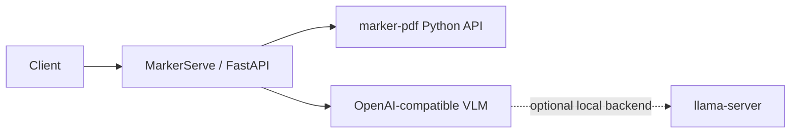

# MarkerServe

Production-oriented HTTP service for Marker OCR.

MarkerServe wraps the upstream `marker-pdf` Python package with a small FastAPI service and uses native llama.cpp for both Marker’s LLM calls and Surya’s OCR/layout VLM. It is independent of the Marker project: MarkerServe does not fork Marker, patch installed files, or bundle model weights.

## Architecture



MarkerServe supports both native llama.cpp and Docker-backed vLLM for Surya. In managed local operation, `scripts/start.ps1` starts the application’s OpenAI-compatible `llama-server`; depending on `SURYA_INFERENCE_BACKEND`, Marker’s Surya backend starts or attaches to a native llama.cpp server or starts a vLLM Docker container for the Surya OCR VLM when OCR is first needed. In external mode, MarkerServe assumes the Marker LLM endpoint is already running and checks it during readiness.

## Requirements and installation

- Windows with an NVIDIA GPU is the initial target; Linux is supported in principle.
- Python 3.12 is the validated Windows setup. Python 3.14 is not currently supported because `marker-pdf==2.0.0` resolves to Pillow 10.4.0, which has no prebuilt Windows wheel for Python 3.14.
- A PyTorch installation compatible with the target CUDA driver.
- `marker-pdf==2.0.0` (installed by this project).
- Optional local llama.cpp build. The launcher auto-discovers `llama-server.exe` on `PATH` or at `D:\llamacpp\llama-server.exe`; set `LLAMA_SERVER_BIN` to override it.

### Using uv

Install [uv](https://docs.astral.sh/uv/getting-started/installation/) if it is not already available, then create the project environment with Python 3.12:

```powershell
irm https://astral.sh/uv/install.ps1 | iex
uv venv --python 3.12
uv sync --extra dev
Copy-Item .env.example .env
```

Run commands through the managed environment without activating it:

```powershell
uv run pytest
uv run python -m uvicorn app.main:app --host 127.0.0.1 --port 8000
```

### Using standard venv and pip

Alternatively, create and activate a Python 3.12 virtual environment manually:

```powershell
py -3.12 -m venv .venv
.\.venv\Scripts\Activate.ps1
python -m pip install --upgrade pip
python -m pip install -e ".[dev]"
Copy-Item .env.example .env
```

Marker downloads its own model assets as needed. MarkerServe does not bundle those assets, llama.cpp binaries, or GGUF weights.

## Configuration

`.env.example` contains the reproducible non-secret defaults. The actual `.env` is ignored by git.

The service maps request and environment options into Marker’s `ConfigParser`, including `mode`, `use_llm`, `output_format`, `processors`, `force_ocr`, and the OpenAI service options. The default configuration uses Marker’s OpenAI-compatible service against `http://127.0.0.1:8080/v1`, model alias `qwen3.5-9b`, and one conversion at a time for predictable 8 GB VRAM usage.

Surya inference defaults to the `llamacpp` backend and also supports `vllm`. For llama.cpp, `LLAMA_SERVER_BIN` is passed through to Surya as `LLAMA_CPP_BINARY`; if it is unset, the launcher and runtime also check `llama-server.exe` on `PATH` and `D:\llamacpp\llama-server.exe`. The Surya GGUF and multimodal projector are downloaded by the upstream llama.cpp backend on first use unless local paths are supplied through Surya’s own environment settings. Select `SURYA_INFERENCE_BACKEND=vllm` to use the Docker-backed implementation instead.

The checked-in `config/models.ini` preserves the supplied llama.cpp aliases and settings. It contains references to Hugging Face repositories, not model files.

## External VLM mode

Start an OpenAI-compatible server separately, then configure:

```dotenv
VLM_MODE=external
VLM_BASE_URL=http://127.0.0.1:8080/v1
MARKER_OPENAI_MODEL=qwen3.5-9b
```

Run MarkerServe:

```powershell
python -m uvicorn app.main:app --host 127.0.0.1 --port 8000
```

## Managed launcher mode

Set `VLM_MODE=managed` in `.env`, then run:

```powershell
.\scripts\start.ps1
```

The launcher resolves `LLAMA_SERVER_BIN`, then `PATH`, then the provided local install location `D:\llamacpp\llama-server.exe`. It starts llama.cpp with `config/models.ini`, polls `/health`, starts MarkerServe, polls both liveness and readiness, and records child PIDs under `.run/processes.json`. Logs are written under `logs/`.

When `uv` is available and `PYTHON_EXE` is not set, the launcher automatically starts MarkerServe with `uv run --project .`. Set `PYTHON_EXE` if you want to use a specific Python executable instead.

Stop both processes with:

```powershell
.\scripts\stop.ps1
```

## API

```text
GET  /health/live
GET  /health/ready
GET  /version
POST /v1/convert
```

The conversion endpoint accepts a multipart PDF upload and optional form fields: `output_format` (`markdown`, `json`, or `html`), `mode`, `use_llm`, `force_ocr`, `page_range`, `processors`, `disable_image_extraction`, and `disable_multiprocessing`.

The upload field is named `file`. The default upload limit is 50 MiB (`MAX_UPLOAD_BYTES`). The filename must end in `.pdf`, and the content must have a `%PDF-` signature. Unknown form fields are rejected with `422 unknown_conversion_options`; in particular, `paginate_output` is not supported.

Example:

```powershell
curl.exe -F "file=@sample.pdf" -F "output_format=markdown" http://127.0.0.1:8000/v1/convert
```

Markdown and HTML are returned as text responses; JSON is returned as the direct JSON document produced by the pinned `marker-pdf==2.0.0` renderer. MarkerServe does not wrap JSON in a `success`/`output` envelope. The JSON renderer normally returns a document with top-level `children` and `block_type`, with page and block nodes containing fields such as `id`, `block_type`, `html`, `polygon`, `bbox`, and nested `children`. Upstream `metadata` is excluded by MarkerServe. See [`docs/api-contract.md`](docs/api-contract.md) for the compatibility contract and example; [`docs/ariadne-integration.md`](docs/ariadne-integration.md) records the client-side migration notes.

Every successful conversion includes `X-MarkerServe-Output-Format` and `X-MarkerServe-Duration-Seconds` headers. Errors use the structured shape `{ "error": { "code", "message", "details" } }`.

`/health/live` only reports process liveness. `/health/ready` returns `503` until Marker’s model runtime is initialized and, when `MARKER_USE_LLM=true`, the configured VLM endpoint and model are available.

`/version` returns the MarkerServe version, API schema version, `marker-pdf` version, Python version, VLM mode/base URL/model, and Marker mode. It is available independently of readiness.

## Concurrency, storage, and limitations

The initial service serializes conversion work with a one-slot in-process semaphore. With the default zero-second queue timeout, a second simultaneous request receives `429 conversion_busy`; increase `CONVERSION_QUEUE_TIMEOUT_SECONDS` to allow bounded waiting. This is intentionally not a durable queue and does not provide job history.

Uploads are written to a temporary file only for the duration of conversion and removed on success or failure. There is no database, authentication, web UI, durable queue, idempotency key, or automatic llama.cpp/model installation. There is no application-level conversion timeout; configure a client or reverse-proxy timeout appropriate to the deployment.

Marker initialization is intentionally lazy at import time but occurs during application startup. If it fails, liveness remains available while readiness reports the failure.

## Testing

Unit/API tests avoid loading GPU models:

```powershell
pytest
```

For an end-to-end smoke test against a running service, use every PDF under `samples/`:

```powershell
.\scripts\test_samples.ps1
```

The script checks liveness and readiness, uploads `blank.pdf`, both simple fixtures, and both image fixtures, and verifies successful output. Use `-BaseUrl` for a non-default service address or `-OutputFormat json` to exercise another response format. Marker models and, when using LLM processors, a healthy VLM endpoint are required.

## Upstream and licensing

MarkerServe is an independent Apache-2.0 project. `marker-pdf` is an upstream dependency and its source/model-asset licenses and usage terms should be reviewed separately. llama.cpp is also an external dependency with its own license. No Marker source files, llama.cpp binaries, GGUF files, API keys, or uploaded documents are committed here.
